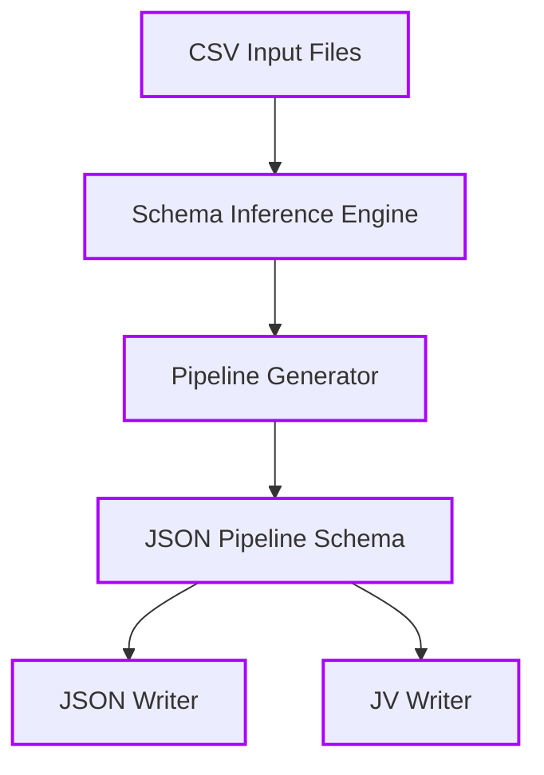
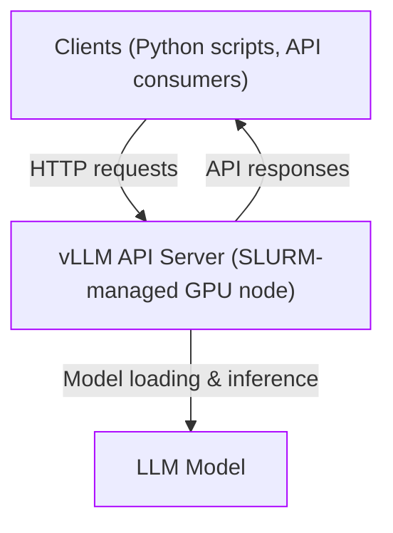
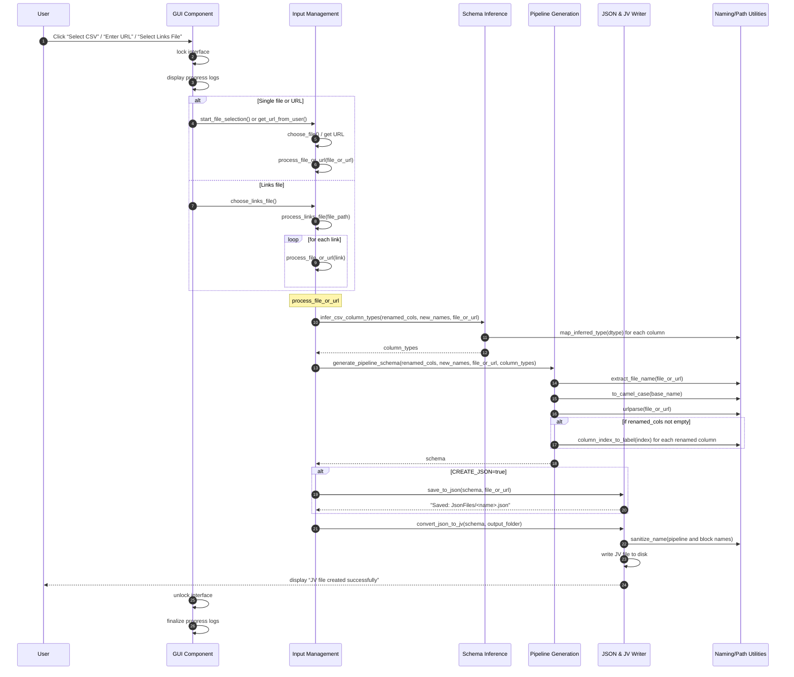
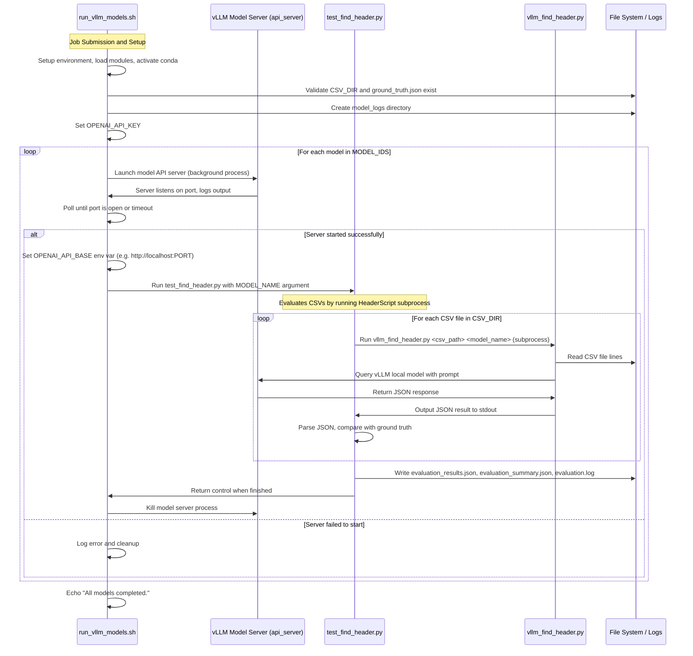
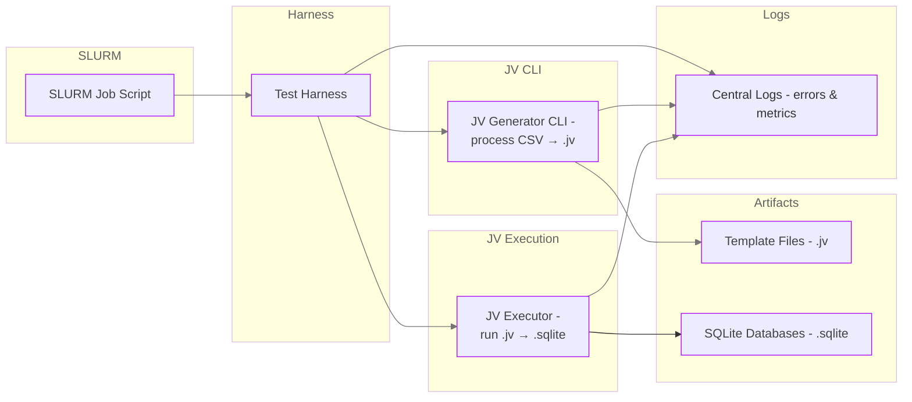
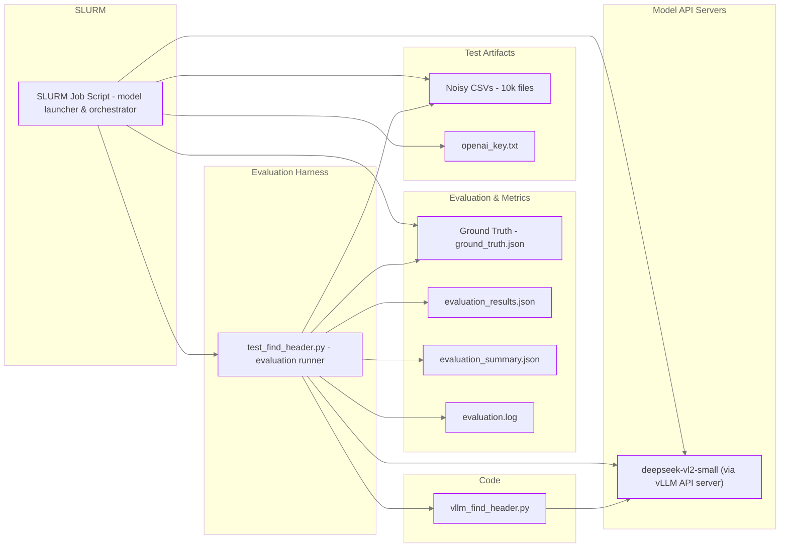

Data Flow Diagram TempGen

Data Flow Diagram LLMInf

Template Generation Implementation Sequence Diagram

llm schema inference sequence diagram

TempGen Test Architecture Diagram

Schema Inference Test Architecture Diagram
