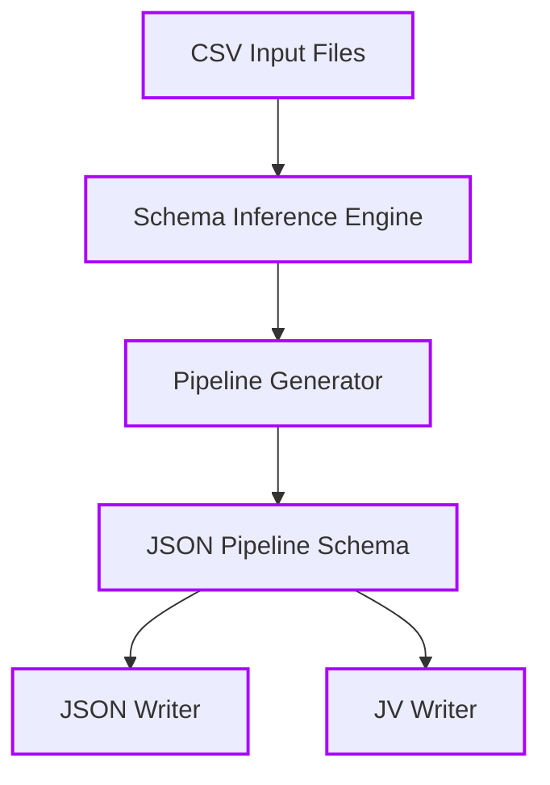
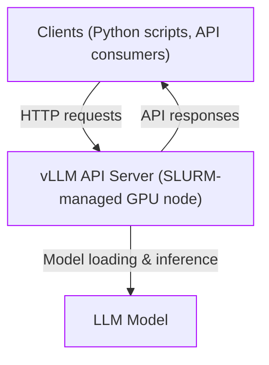

Data Flow Diagram TempGen

```mermaid
flowchart TB
A["CSV Input Files"] --> B["Schema Inference Engine"]
B --> C["Pipeline Generator"]
C --> D["JSON Pipeline Schema"]
D --> E["JSON Writer"]
D --> F["JV Writer"]

    style A stroke:#AA00FF,stroke-width:2px
    style B stroke:#AA00FF,stroke-width:2px
    style C stroke:#AA00FF,stroke-width:2px
    style D stroke:#AA00FF,stroke-width:2px
    style E stroke:#AA00FF,stroke-width:2px
    style F stroke:#AA00FF,stroke-width:2px
```

Data Flow Diagram LLMInf

```mermaid

---
config:
  layout: dagre
---
flowchart TD
A["Clients (Python scripts, API consumers)"] -- HTTP requests --> B["vLLM API Server (SLURM-managed GPU node)"]
B -- API responses --> A
B -- Model loading & inference --> C["LLM Model"]
style A stroke:#AA00FF
style B stroke:#AA00FF
style C stroke:#AA00FF

```
