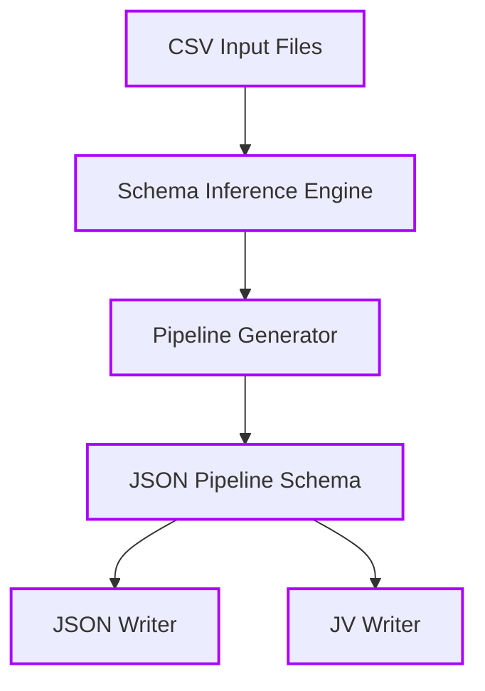
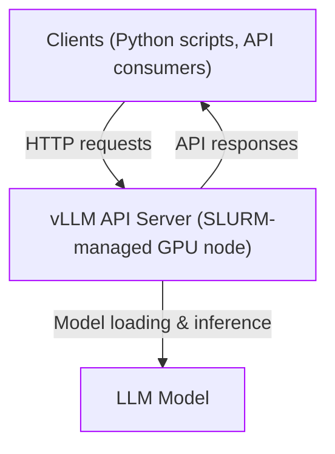
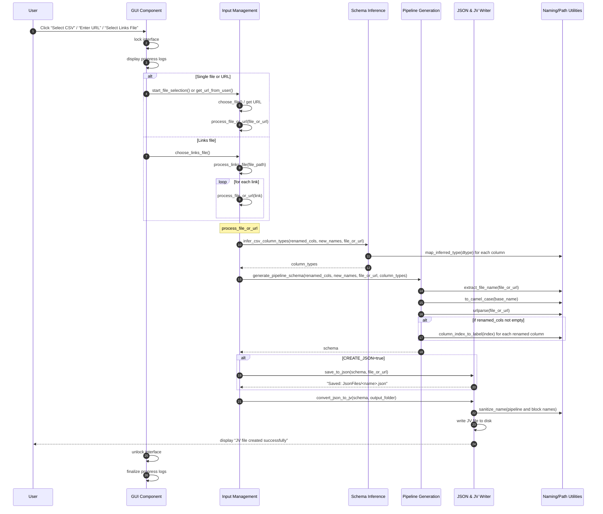

Data Flow Diagram TempGen

```mermaid
flowchart TB
A["CSV Input Files"] --> B["Schema Inference Engine"]
B --> C["Pipeline Generator"]
C --> D["JSON Pipeline Schema"]
D --> E["JSON Writer"]
D --> F["JV Writer"]

    style A stroke:#AA00FF,stroke-width:2px
    style B stroke:#AA00FF,stroke-width:2px
    style C stroke:#AA00FF,stroke-width:2px
    style D stroke:#AA00FF,stroke-width:2px
    style E stroke:#AA00FF,stroke-width:2px
    style F stroke:#AA00FF,stroke-width:2px
```

Data Flow Diagram LLMInf

```mermaid

---
config:
  layout: dagre
---
flowchart TD
A["Clients (Python scripts, API consumers)"] -- HTTP requests --> B["vLLM API Server (SLURM-managed GPU node)"]
B -- API responses --> A
B -- Model loading & inference --> C["LLM Model"]
style A stroke:#AA00FF
style B stroke:#AA00FF
style C stroke:#AA00FF

```
Template Generation Implementation Sequence Diagram

```mermaid
sequenceDiagram
    autonumber
    participant User
    participant GUI as GUI Component
    participant Input as Input Management
    participant Schema as Schema Inference
    participant Pipeline as Pipeline Generation
    participant JSONJV as JSON & JV Writer
    participant Naming as Naming/Path Utilities

    User->>GUI: Click “Select CSV” / “Enter URL” / “Select Links File”
    GUI->>GUI: lock interface
    GUI->>GUI: display progress logs

    alt Single file or URL
        GUI->>Input: start_file_selection() or get_url_from_user()
        Input->>Input: choose_file() / get URL
        Input->>Input: process_file_or_url(file_or_url)
    else Links file
        GUI->>Input: choose_links_file()
        Input->>Input: process_links_file(file_path)
        loop for each link
            Input->>Input: process_file_or_url(link)
        end
    end

    Note over Input: process_file_or_url  
    Input->>Schema: infer_csv_column_types(renamed_cols, new_names, file_or_url)  
    Schema->>Naming: map_inferred_type(dtype) for each column  
    Schema-->>Input: column_types  

    Input->>Pipeline: generate_pipeline_schema(renamed_cols, new_names, file_or_url, column_types)  
    Pipeline->>Naming: extract_file_name(file_or_url)  
    Pipeline->>Naming: to_camel_case(base_name)  
    Pipeline->>Naming: urlparse(file_or_url)  
    alt if renamed_cols not empty
        Pipeline->>Naming: column_index_to_label(index) for each renamed column
    end
    Pipeline-->>Input: schema  

    alt CREATE_JSON=true
        Input->>JSONJV: save_to_json(schema, file_or_url)  
        JSONJV-->>Input: "Saved: JsonFiles/<name>.json"  
    end

    Input->>JSONJV: convert_json_to_jv(schema, output_folder)  
    JSONJV->>Naming: sanitize_name(pipeline and block names)  
    JSONJV->>JSONJV: write JV file to disk  
    JSONJV-->>User: display “JV file created successfully”

    GUI->>GUI: unlock interface
    GUI->>GUI: finalize progress logs

```

